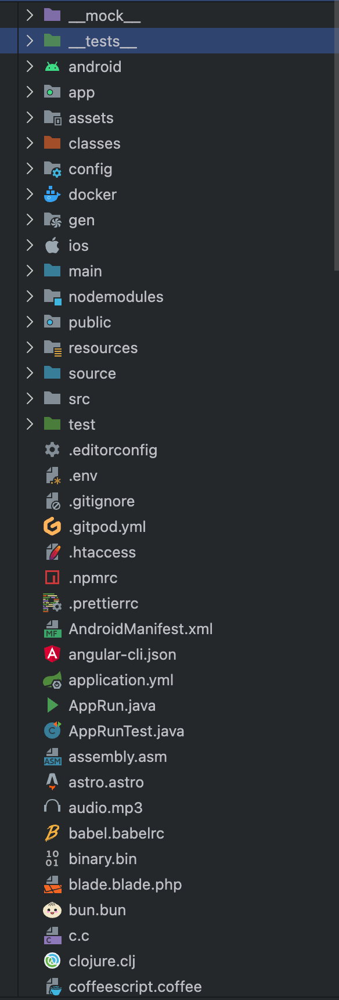

# idea icons themes for vscode

JetBrains 风格的 VSCode 文件图标主题，针对 Maven / SpringBoot 项目做了定制。fork 自 [brennandenny/vsc-jetbrains-icons-enhanced](https://github.com/brennondenny/vsc-jetbrains-icons-enhanced)。

内置一个 IntelliJ 风格的颜色主题 **IntelliJ IDEA Classic Dark**，移植自 [a-havrysh/vscode-intellij-theme](https://github.com/a-havrysh/vscode-intellij-theme.git)。

## 定制图标

| 文件 / 目录 | 图标 |
|------------|------|
| `pom.xml` | Maven |
| `application.yml` | SpringBoot |
| `AppRun.java` | 启动类 |
| `AppRunTest.java` | 测试类 |
| `main/java/` `test/java/` | 蓝 / 绿文件夹 |

> 由于 VSCode 无法区分接口与抽象类，所有 `.java` 文件显示同一图标。

## 安装

安装后在 `文件图标主题` 中选择 **idea icons themes for vscode**。

在 `颜色主题` 中选择 **IntelliJ IDEA Classic Dark** 即可启用配套的颜色主题。

## 许可

代码 [MIT](LICENSE) © 2026 wangtk；图标素材源自 [JetBrains](https://jetbrains.design/intellij/resources/icons_list/)（Apache 2.0）；颜色主题移植自 [a-havrysh/vscode-intellij-theme](https://github.com/a-havrysh/vscode-intellij-theme.git)。
